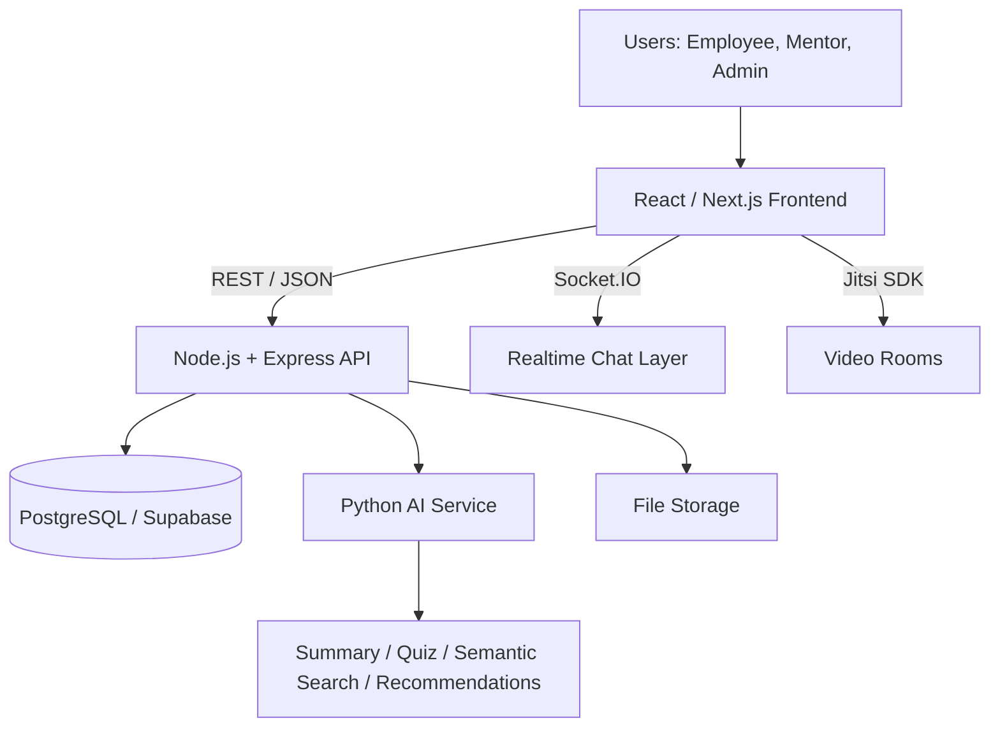
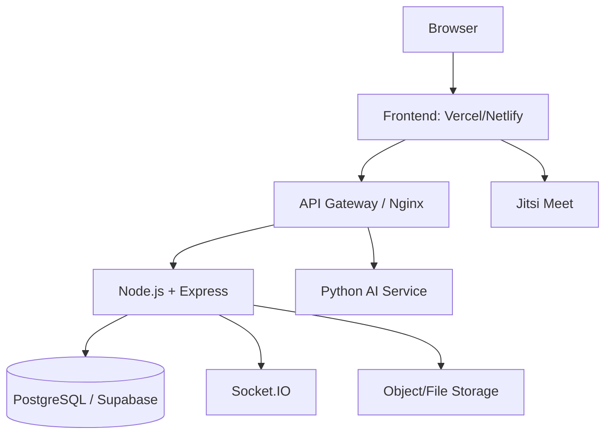

# Peer Connect Complete Architecture

This project structure is derived from your idea document:
`c:\Users\ADMIN\Downloads\make a complete archecite diagram of webisite...wi.pdf`

## 1) System Overview



## 2) Layered Architecture

```mermaid
flowchart LR
    subgraph Client Layer
      P1[Public Pages]
      E1[Employee App]
      A1[Admin App]
    end

    subgraph Application Layer
      M1[Auth and User Profile]
      M2[Skills and Goals]
      M3[Repository]
      M4[AI Assistant]
      M5[Peer Matching and Sessions]
      M6[Feedback and Ratings]
      M7[Admin Analytics]
    end

    subgraph Data and Services
      D1[(PostgreSQL)]
      D2[Socket.IO]
      D3[Python AI Service]
      D4[Jitsi Meet]
      D5[Object/File Storage]
    end

    Client Layer --> Application Layer --> Data and Services
```

## 3) Frontend Structure (Implemented)

`frontend/src/app`

- Public:
`/` `/about` `/features` `/login` `/register`
- Employee:
`/dashboard` `/profile` `/skills` `/learning` `/knowledge`
`/ai-assistant` `/peers` `/chat` `/video-session`
`/history` `/quizzes` `/analytics`
- Admin:
`/admin/dashboard` `/admin/employees` `/admin/resources`
`/admin/performance-analytics` `/admin/peer-session-analytics`
`/admin/ai-usage-analytics`

## 4) Backend Module Structure (Implemented)

`backend/src/routes/modules`

- `auth.routes.js`
- `users.routes.js`
- `skills.routes.js`
- `learning.routes.js`
- `resources.routes.js`
- `ai.routes.js`
- `peer.routes.js`
- `chat.routes.js`
- `feedback.routes.js`
- `analytics.routes.js`
- `admin.routes.js`
- `quizzes.routes.js`

## 5) Core API Map

- Auth:
`GET /auth/me` `PUT /auth/profile`
- Users:
`GET /users` `GET /users/:id` `GET /users/:id/activity`
- Skills:
`GET /skills` `POST /skills` `POST /user-skills`
- Learning:
`GET /courses` `POST /courses` `POST /courses/:id/enroll`
- Repository:
`GET /resources` `POST /resources` `GET /resources/search`
- AI:
`POST /ai/summary` `POST /ai/quiz` `POST /ai/search`
`POST /ai/recommend-resource` `POST /ai/recommend-peer`
- Peer and Chat:
`GET /peer/requests` `POST /peer/requests` `GET /peer/matches`
`GET /conversations` `POST /conversations`
- Feedback:
`POST /feedback` `GET /feedback/session/:id` `GET /ratings/user/:id`
- Analytics and Admin:
`GET /analytics/dashboard` `GET /analytics/scores` `GET /analytics/leaderboard`
`GET /admin/dashboard` `GET /admin/users` `GET /admin/resources`
`GET /admin/sessions` `GET /admin/ai-usage` `GET /admin/reports`

## 6) Database Design (Document-Aligned)

Primary entities from the architecture doc:

- `users`, `roles`, `profiles`
- `skills`, `user_skills`, `goals`, `achievements`
- `resources`, `resource_tags`, `bookmarks`
- `peer_requests`, `peer_matches`
- `chat_rooms`, `chat_messages`
- `video_sessions`
- `quizzes`, `quiz_attempts`
- `feedback`, `ratings`
- `ai_logs`, `activity_logs`

## 7) Deployment Blueprint



## 8) Open-Source GitHub References

- React: https://github.com/facebook/react
- Express: https://github.com/expressjs/express
- PostgreSQL: https://github.com/postgres/postgres
- Socket.IO: https://github.com/socketio/socket.io
- Jitsi Meet: https://github.com/jitsi/jitsi-meet
- Jitsi React SDK: https://github.com/jitsi/jitsi-meet-react-sdk
- FastAPI: https://github.com/fastapi/fastapi
- Flask: https://github.com/pallets/flask
- Sentence Transformers: https://github.com/UKPLab/sentence-transformers
- Haystack: https://github.com/deepset-ai/haystack
- Multer: https://github.com/expressjs/multer
- TipTap: https://github.com/ueberdosis/tiptap
- Recharts: https://github.com/recharts/recharts
- Chart.js: https://github.com/chartjs/Chart.js
- React Hook Form: https://github.com/react-hook-form/react-hook-form
- TanStack Table: https://github.com/TanStack/table
- bcrypt.js: https://github.com/dcodeIO/bcrypt.js
- node-jsonwebtoken: https://github.com/auth0/node-jsonwebtoken
